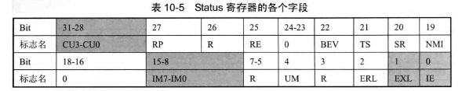
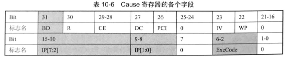
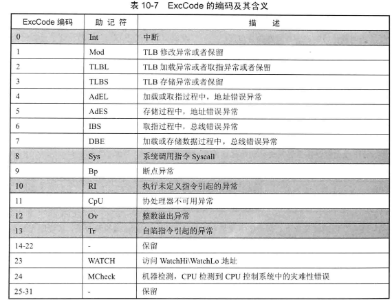
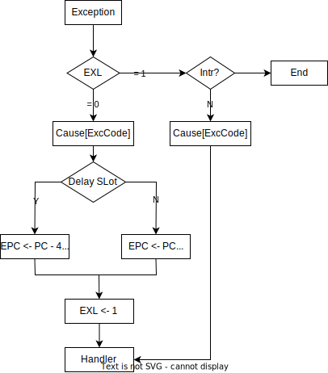

<!-- @import "[TOC]" {cmd="toc" depthFrom=1 depthTo=6 orderedList=false} -->

<!-- code_chunk_output -->

- [OPEN\_MIPS](#open_mips)
  - [CP0 Access Insruction Implement](#cp0-access-insruction-implement)
    - [Registers](#registers)
  - [Exception Relative Instruction Implement](#exception-relative-instruction-implement)
    - [Exception in MIPS32 Arch](#exception-in-mips32-arch)
    - [Precise Exception](#precise-exception)
    - [Exception handle procedure](#exception-handle-procedure)

<!-- /code_chunk_output -->

# OPEN_MIPS

## CP0 Access Insruction Implement

### Registers

## Exception Relative Instruction Implement

### Exception in MIPS32 Arch

openmips only implement the following 6 exception types:

| Priority | Excepton  | Description |
|----------|-----------|-------------|
|1        | Reset |  Hardware Reset           |
|7        | Interrupt |  6 Hardware Int and 2 Software           |
| 16       | Sys       |  System Call           |
| 16       | RI        |  Invalid instruction           |
| 16       | Ov        |   Overflow(add,addi,sub)          |
| 16       | Tr        |  Self Trap           |

Hardware reset is a particular exception. It don't need to return from exception
roution,so don't need to protect context and save return address. When reset,all
registers are cleared to zero,and fetch instruction from address 0x0.

### Precise Exception

**Exception Victim**: the instruction occur exception.
**Problem**: To support precise interrupt,the sequence of exception occurence must be same with the sequence of instruction.
**Solution**: The previous exception get marked, rather than being handled immediately, and the pipeline keep going.
For most processor,there is a special pipeline stage to handle exception.
Although the exception can occur at random time, the instruction must arrive at same stage in order.

### Exception handle procedure

| Excepton  | Vector |
|----------------|-----------|
| Reset       |   0x20        |
| Interrupt   | 0x40           |
| Sys          | 0x40           |
| RI            |  0x40           |
| Ov           |   0x40         |
| Tr            |  0x40           |

***

- ERET instruction is processed as special exception
- suport exception nesting
- Do not support exception priority
